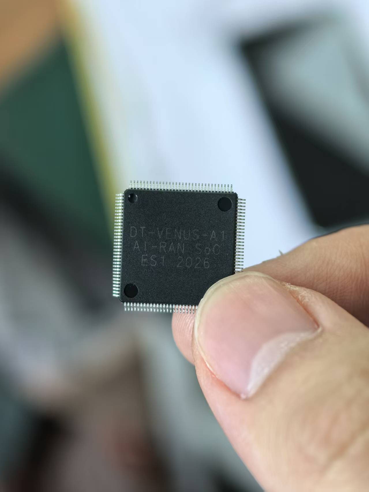
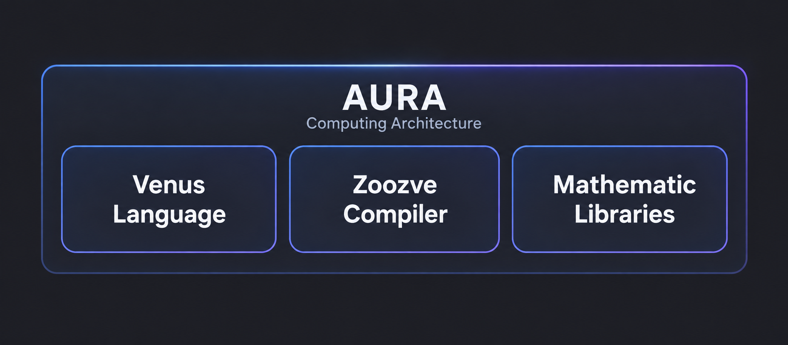
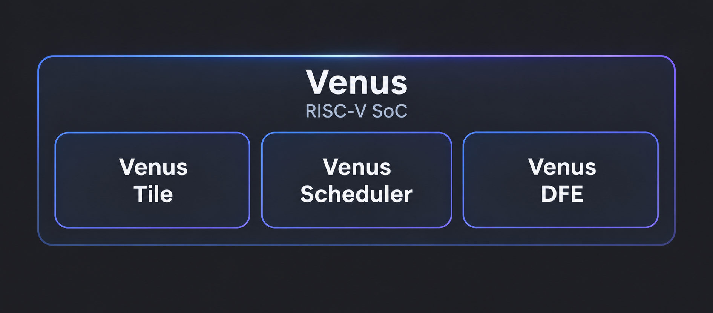

<main id="main" class="echo-home">
  

    

      
Open Platform for Communication-AI Convergence Fusion

      
ACE-Echo
<h1>Communication. Intelligence. One architecture.</h1>
      
An open development platform built on <strong>Venus</strong>, our programmable RISC-V processor for communication–AI convergence. Explore the architecture. Build applications for our hardware. Shape what comes next.

      

        <a class="hero-button primary" href="venus1_get_started.html">Explore ACE-Echo 1.0</a>
        <a class="hero-button secondary" href="news.html">Latest Updates</a>
      

    

    

      
The Echo ecosystem

      <ul class="hero-list">
        <li>Communication &amp; AI operators for FFT, Decoder, Conv2D/3D, GELU/SiLU and more</li>
        <li>An integrated development workflow with external compiler tools</li>
        <li>Gem5 simulation for Venus application development and approximate performance evaluation</li>
        <li>Real-world application demos: 5G/LTE, AI-Based Channel Estimation, GNSS, LoRa, and more</li>
        <li>An initial Agent-assisted development framework in 1.0</li>
      </ul>
    

  

  <section class="silicon-stage" aria-labelledby="silicon-title">
    

First-generation silicon
<h2 id="silicon-title">An idea. Now in your hands.</h2>
Our first-generation chip has taped out and achieved first light.
<a href="venus1-first-light.html">Meet the first Venus chip ↗</a>

    <figure class="silicon-portrait">

<figcaption>DT-VENUS-A1Real silicon. Successful bring-up.</figcaption></figure>
  </section>
  <section class="section-block" id="architecture">
    

      
Architecture

      <h2>AURA inside. Venus at the heart.</h2>
The architecture, the chip and the tools. Designed to evolve together.

    

    

      <article class="stack-card">
        <h3 class="stack-title">AURA: AI Unified Radio Architecture</h3>
        
AURA is the foundational computing architecture behind Echo. It is designed for <strong>tight integration of perception, communication, and computation</strong>, optimized for edge and low-latency scenarios. It is composed of Venus Language, Zoozve Compiler, and Mathematic Libraries.

        
If you want to learn more about compilers, see <a href="https://doi.org/10.1145/3735452.3735526">Zoozve: A Strip-Mining-Free RISC-V Vector Extension with Arbitrary Register Grouping Compilation Support (WIP)</a>.

        

          
        

      </article>
      <article class="stack-card">
        <h3 class="stack-title">Venus: Our RISC-V Communication-AI Chip</h3>
        
Venus is a custom RISC-V processor based on the AURA architecture.

        <ul class="feature-list">
          <li>Instruction set extensions for communication and neural workloads</li>
          <li>Built-in accelerators such as the vector engine</li>
          <li>Composed of Venus Tile, Venus Scheduler, and Venus DFE</li>
          <li>Research directions spanning wireless baseband, edge AI and communication–AI integration</li>
        </ul>
        
For details, see <a href="https://doi.org/10.1145/3658617.3697558">A Hierarchical Dataflow-Driven Heterogeneous Architecture for Wireless Baseband Processing</a>.

        

          
        

      </article>
    

  </section>

  <section class="section-block" id="capabilities">
    

      
Capabilities

      <h2>Your ideas. Running on Venus.</h2>
    

    

      
ACE-Echo 1.0
A usable Gem5-based simulator and the first version of our Agent-assisted development framework.

      <table><thead><tr><th>Capability</th><th>What you can do in 1.0</th></tr></thead><tbody>
        <tr><td>Develop for Venus</td><td>Write application tasks in Venus C and describe their dependencies in BAS.</td></tr>
        <tr><td>Explore performance</td><td>Run the Gem5 model and quickly estimate task timing and data movement.</td></tr>
        <tr><td>Iterate with an Agent</td><td>Use the initial Agent framework with developer guidance and review.</td></tr>
        <tr><td>Build on shared work</td><td>Start with the paired DSL and Venus1 samples, then contribute your own applications.</td></tr>
      </tbody></table>
      
Cycle-level simulation supports approximate performance evaluation. See the <a href="venus1_validation.html">validation scope</a> for measured accuracy and model boundaries.

    

  </section>

  <section class="section-block applications" id="applications">

Communication meets intelligence
<h2>One foundation. Many possibilities.</h2>
Explore the applications and research behind the Echo ecosystem.

<a href="breakthroughs_in_application.html">01<h3>5G &amp; LTE</h3>
Synchronization, cell search and baseband processing.
↗</a><a href="academic-4.html">02<h3>Communication + AI</h3>
Architecture research connecting neural workloads and wireless processing.
↗</a><a href="mydoc_supported_features.html">03<h3>Beyond one protocol</h3>
Explore GNSS, LoRa and other signal-processing directions.
↗</a>

Ecosystem examples and research directions. Available applications and validation coverage depend on the selected hardware and release.
</section>
  <section class="section-block" id="audience">
    

      
Audience

      <h2>A platform for what comes next.</h2>
    

    

      <article class="audience-card">
        
Academia &amp; Researchers

        
Open-Source Platform for Communication-AI Research

        
Explore communication–AI algorithms and hardware-aware implementations in a shared, programmable research environment.

      </article>
      <article class="audience-card">
        
Industry

        
Decoupled Software-Hardware Baseband Chip Solution

        
Explore applications and system trade-offs for a programmable communication processor.

        
Use simulation to compare design choices before hardware evaluation.

      </article>
      <article class="audience-card">
        
Standards Organizations

        
Explore Future Wireless Systems

        
Investigate new wireless processing ideas on an architecture designed around communication and intelligent computation.

        
Develop reusable experiments and share findings with the community.

      </article>
    

    <blockquote class="home-quote">
      <strong>Echo is your playground.</strong> Whether you're building, testing, or scaling, Echo gives you the freedom to create.
    </blockquote>
  </section>

  <section class="section-block" id="roadmap">
    

      
Roadmap

      <h2>Assistance today. Intent-driven development next.</h2>
    

    
  </section>

  <section class="section-block latest-news" id="news">

Latest from ACE Lab
<h2>Silicon is only the beginning.</h2>
<a class="news-feature" href="venus1-first-light.html">CHIP MILESTONE · 2026<h3>First-generation chip. Successful tape-out. First light.</h3>
From fabrication and packaging to bring-up and real-signal NR cell search.
Read the announcement ↗</a><a class="all-news" href="news.html">All project news ↗</a></section>
  <section class="section-block cta-section" id="get-started">
    

      

        
Get Started

        <h2>Start building with Echo now</h2>
      

      <ol class="start-list">
        <li>Visit our quick-start guide: <a href="venus1_get_started.html">Get started with ACE-Echo 1.0</a></li>
        <li>Get the platform source and configure the external compiler tools.</li>
        <li>Join the community and start building.</li>
      </ol>
    

    

      
Community

      <h2>Join the Echo Community</h2>
      
Email: <a href="mailto:shenyihao@shu.edu.cn">shenyihao@shu.edu.cn</a>

      
<a href="https://github.com/ACELab-SHU/ACE-Echo">Explore the source on GitHub ↗</a>

      <blockquote class="closing-quote">A shared foundation for communication and intelligence.</blockquote>
      
We warmly welcome more developers, researchers, and collaborators to join us on this journey.

    

  </section>
</main>
